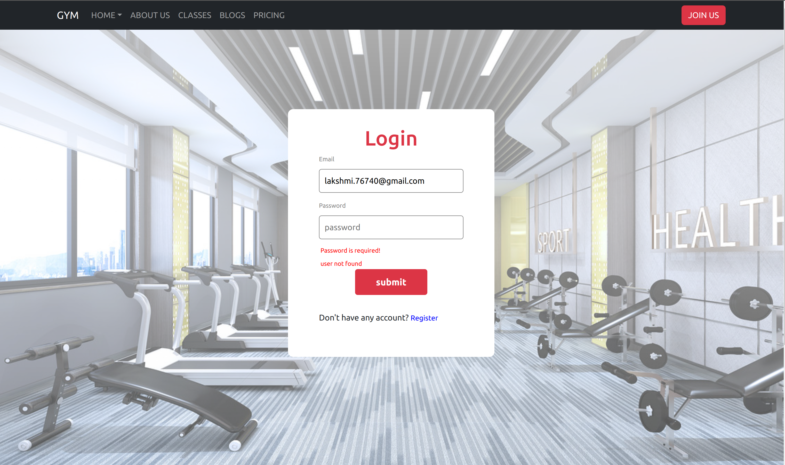

# Gym Project

## Deployed link : [Deployed link](https://gym-project-wheat.vercel.app/)

### Home page :

### Login :

### Register :

* Created a static landing page of the gym with different sections like header, about us, training programs of the gym, and pricing section.
* Included login and signup pages along with the validation.
* Registration details store in local storage.
* It is responsive for mobile,tablet and desktop views.
* Tech stacks used: 
   * **HTML, CSS, Javascript, React, Bootstrap,**
